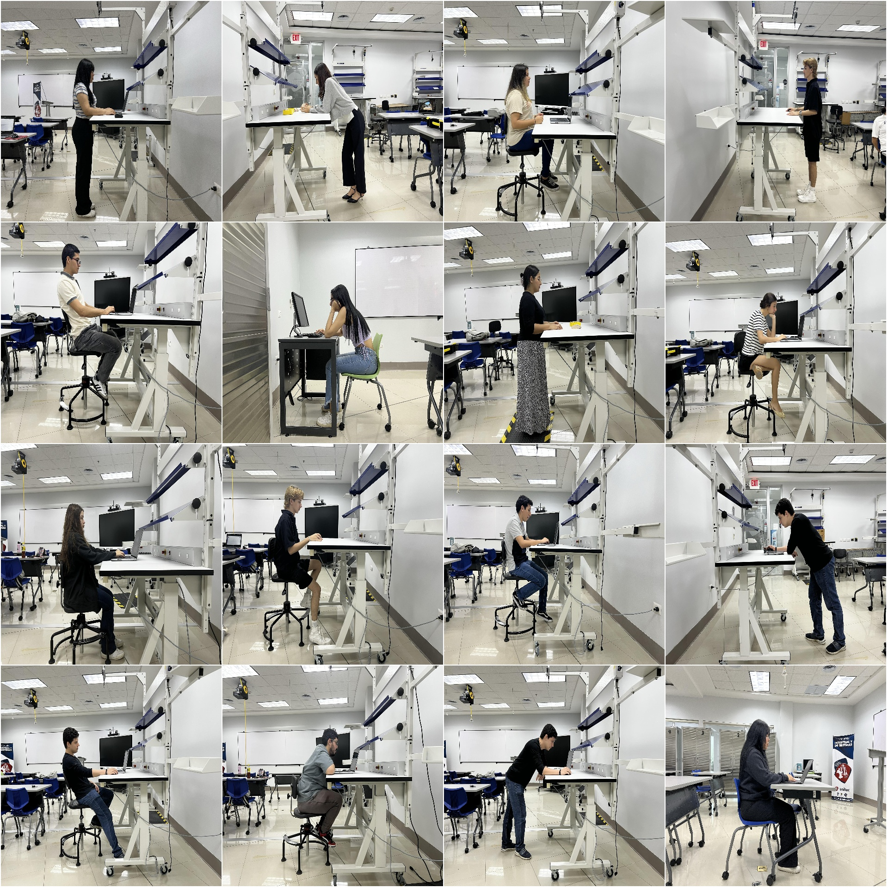
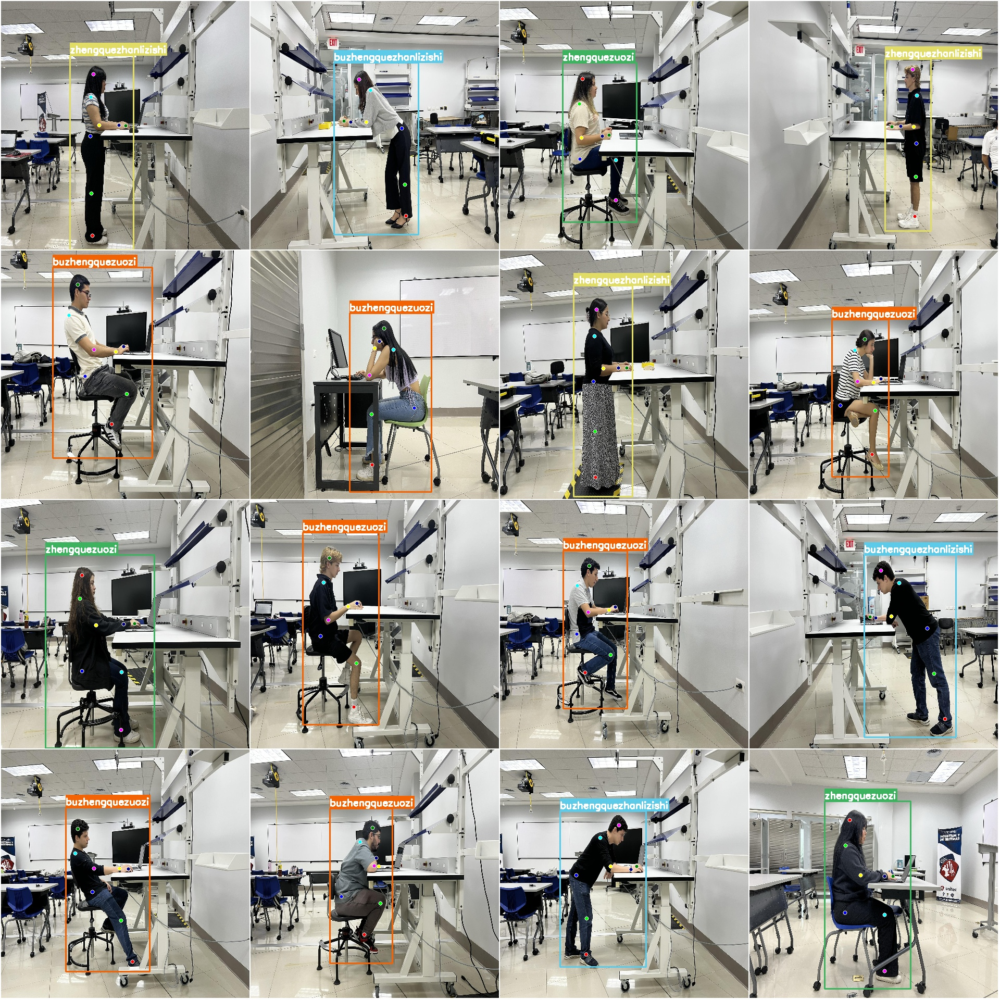

# Office Scene Activity Posture Estimation Data Set - COCO+YOLO Format

### Dataset Format:
- **YOLO Keypoint Format** (Note: This is not the target detection or segmentation YOLO format, but only contains JPG images and corresponding YOLO format TXT files.)
- Number of Images (JPG file count): 1330
- Number of Annotations (TXT file count): 1330
- Training set size: 932
- Validation set size: 267
- Test set size: 131
- Number of annotation categories: 4
- Annotation category names: ['Zhengquezhanlizishi', 'Zhengquezuozi', 'Buzhengquezhanlizishi', 'Buzhengquezuozi']
- Corresponding Chinese category names: ["Correct Posture", "Correct Pose", "Incorrect Posture", "Incorrect Pose"]
- Number of keypoints per category: 8
- Boxes for each category:
  - Zhengquezhanlizishi boxes=247
  - Zhengquezuozi boxes=331
  - Buzhengquezhanlizishi boxes=277
  - Buzhengquezuozi boxes=475
  Total boxes=1330
- Image resolutions: Multiple resolution images, such as 2048x1536, 4032x3024, etc.

#### Import Note:
- The dataset has been split into training, validation, and test sets, which can be directly used for training models with YOLOv5-Pose, YOLOv8-Pose, YOLOv11-Pose, or YOLOv26-Pose.
- It should be noted that this dataset does not guarantee the accuracy of the trained model or the weights file.

#### Image Preview:
- [Example Image (Randomly selected 16 images)]
- [Annotation drawing results]

## Images

Here is a pay link on Stripe ( https://buy.stripe.com/3cs8yP7sY87d0vu9AB ). Please contact me lonlonago@foxmail.com after funding $89, and I will send you a complete data files , thank you!

